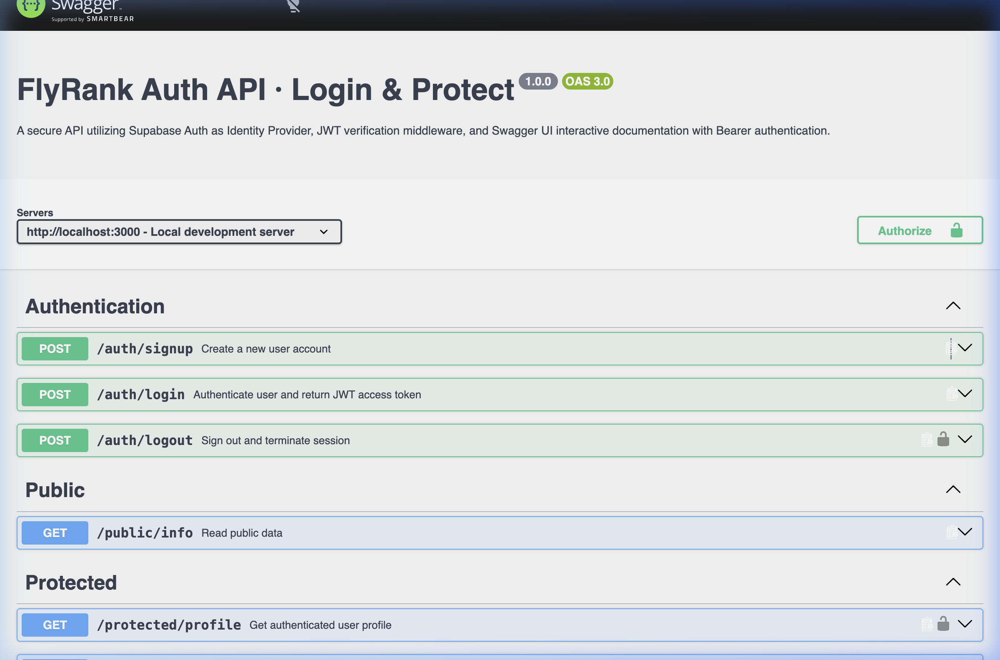

# FlyRank Auth · Login & Protect (Assignment A4)

A production-grade, secure authentication REST API built with **Node.js**, **Express**, and **Supabase Auth** as the Identity Provider (IdP). This system handles user registration, credential authentication, JWT token issuance and verification, route guarding via reusable middleware, brute-force defense, and interactive Swagger UI documentation with Bearer authentication.



---

## 📖 The Big Idea: The Auth Trust Triangle

In real-world backend engineering, applications never store plain-text passwords or implement custom cryptography. Instead, security relies on a **trust triangle**:

```
                   +---------------------------+
                   |  Supabase Auth (IdP)      |
                   |  - Stores hashed passwords|
                   |  - Signs JWT access tokens|
                   +---------------------------+
                     ^                       ^
     1. Credentials  |                       | 4. Verification
        (email/pass) |                       |    (getUser)
                     v                       v
            +-----------------+     +-----------------+
            |  Client (User)  |---->| Backend Server  |
            +-----------------+  3. | (Express API)   |
                               JWT  +-----------------+
```

1. **Sign Up / Login**: Client sends credentials (`email` + `password`) directly to Supabase via our backend.
2. **The Token**: Supabase verifies the credentials and returns a cryptographically signed JSON Web Token (**JWT** access token) and a refresh token.
3. **The Request**: The client requests protected resources by including the JWT in the standard header: `Authorization: Bearer <access_token>`.
4. **Token Verification**: The backend auth middleware verifies the token signature against Supabase (`supabase.auth.getUser(token)`). If authentic and unexpired, the gate opens; otherwise, access is rejected.

---

## 🛠️ Tech Stack & Requirements

- **Runtime**: Node.js v18+ (tested on Node v24)
- **Framework**: Express (ES Modules)
- **Identity Provider**: Supabase Auth (`@supabase/supabase-js`)
- **Security & Utilities**: `dotenv`, `cors`, `express-rate-limit`
- **Documentation**: OpenAPI 3.0 / Swagger UI (`swagger-ui-express`)

---

## ⚡ Quickstart & Setup (Under 5 Minutes)

### 1. Clone the repository & install dependencies
```bash
git clone <your-repo-url>
cd login-auth
npm install
```

### 2. Configure Environment Variables
Copy the `.env.example` template to `.env`:
```bash
cp .env.example .env
```

Open `.env` and fill in your Supabase credentials:
```env
SUPABASE_URL=https://your-project-id.supabase.co
SUPABASE_KEY=your_supabase_anon_key_here
PORT=3000
```
> [!TIP]
> **Supabase Setup Tip**:
> 1. Go to [supabase.com](https://supabase.com) and create a free project.
> 2. In your Supabase Dashboard, navigate to **Project Settings → API** to find your **Project URL** and public **anon key**.
> 3. Go to **Authentication → Sign In / Providers → Email** and toggle **"Confirm email" OFF** so test signups can log in immediately.
>
> *(Note: If placeholder credentials are used, the API gracefully operates in simulated dev mode so test suites and endpoints run out of the box).*

### 3. Run the Server
To start the server:
```bash
npm start
```
For development with auto-reload:
```bash
npm run dev
```

The API will start at `http://localhost:3000`. Interactive Swagger UI is available at `http://localhost:3000/docs`.

### 4. Run Automated Test Suite
Run the comprehensive automated verification suite (25 assertions covering all stages):
```bash
npm test
```

---

## 🚪 API Reference

| Method | Endpoint | Auth Required | Status Codes | Description |
|---|---|---|---|---|
| `POST` | `/auth/signup` | None | `201`, `400` | Registers a new account with `email` and `password`. |
| `POST` | `/auth/login` | None | `200`, `400`, `401`, `429` | Authenticates credentials; returns JWT `access_token` and `refresh_token`. Rate-limited. |
| `POST` | `/auth/refresh` | None | `200`, `400`, `401` | Exchanges a valid `refresh_token` for a fresh access token. |
| `POST` | `/auth/logout` | `Bearer <token>` | `204`, `401` | Terminates user session. |
| `GET` | `/public/info` | None | `200` | Public open endpoint accessible to anyone without auth. |
| `GET` | `/protected/profile` | `Bearer <token>` | `200`, `401` | Returns safe user metadata (`id`, `email`, `created_at`). |
| `GET` | `/protected/dashboard` | `Bearer <token>` | `200`, `401` | Second protected endpoint demonstrating reusable middleware. |
| `GET` | `/protected/admin` | `Bearer <token>` | `200`, `401`, `403` | Privileged route demonstrating 403 Forbidden vs 401 Unauthorized. |

---

## 🧪 Testing with cURL

### 1. Register a new user
```bash
curl -i -X POST http://localhost:3000/auth/signup \
  -H "Content-Type: application/json" \
  -d '{"email":"test@example.com","password":"password123"}'
```
*Expected output: `201 Created` with user JSON.*

### 2. Log in to obtain tokens
```bash
curl -i -X POST http://localhost:3000/auth/login \
  -H "Content-Type: application/json" \
  -d '{"email":"test@example.com","password":"password123"}'
```
*Expected output: `200 OK` returning `access_token` (JWT) and `refresh_token`.*

### 3. Access public endpoint (No Auth)
```bash
curl -i http://localhost:3000/public/info
```
*Expected output: `200 OK` with `{"message": "Welcome stranger! This info is public."}`*

### 4. Access protected profile without token (Rejected)
```bash
curl -i http://localhost:3000/protected/profile
```
*Expected output: `401 Unauthorized` with `{"error": "Access token required"}`*

### 5. Access protected profile with valid JWT
```bash
curl -i http://localhost:3000/protected/profile \
  -H "Authorization: Bearer <PASTE_YOUR_ACCESS_TOKEN_HERE>"
```
*Expected output: `200 OK` with `{ "id": "...", "email": "test@example.com", "created_at": "..." }`.*

### 6. Access protected profile with forged / tampered token (Rejected)
```bash
# Alter any single character in the token string:
curl -i http://localhost:3000/protected/profile \
  -H "Authorization: Bearer <TAMPERED_TOKEN>"
```
*Expected output: `401 Unauthorized` with `{"error": "Invalid or expired token"}`.*

### 7. Sign Out
```bash
curl -i -X POST http://localhost:3000/auth/logout \
  -H "Authorization: Bearer <PASTE_YOUR_ACCESS_TOKEN_HERE>"
```
*Expected output: `204 No Content`.*

---

## 🔒 Security Deep Dive: Key Concepts Explained

### 1. HTTP 401 Unauthorized vs HTTP 403 Forbidden
- **401 Unauthorized** = *"I do not know who you are."*
  Returned when credentials/tokens are missing, invalid, expired, or tampered with. The request cannot proceed until authentication is proven.
- **403 Forbidden** = *"I know exactly who you are, but you are not allowed in."*
  Returned when the user is fully authenticated (valid JWT), but their identity or role lacks the necessary permissions (e.g., a standard user attempting to access `/protected/admin`).

### 2. Why JWT Access Tokens are Short-Lived
JWT access tokens are **stateless**: every server verifies them by checking their cryptographic signature without making constant database lookups. However, because they are stateless, an issued JWT cannot be trivially revoked before its expiration. To mitigate the risk of token theft (via man-in-the-middle, XSS, or device compromise), access tokens have a short lifespan (typically 1 hour). When it expires, the client uses a secure, revocable **refresh token** via `POST /auth/refresh` to obtain a fresh access token.

### 3. Why Brute-Force Rate Limiting Lives on `/auth/login`
Authentication routes are prime targets for credential-stuffing bots and dictionary attacks trying thousands of passwords per second. Rate limiting (`express-rate-limit`) on `POST /auth/login` throttles requests per IP address (returning `429 Too Many Requests`), neutralizing high-volume automated attacks before they consume server CPU or Identity Provider quotas.

### 4. The Stateless JWT Logout Conundrum
When a user logs out in a stateless system, the client deletes its copy of the access token, but the token itself remains cryptographically valid until its expiration timestamp (`exp`). Real-world defense combines:
- Short access token lifetimes (e.g. 15–60 minutes).
- Immediate invalidation of the long-lived refresh token in Supabase.
- (Optional for high-security environments) Token revoking blacklists in Redis.

---

## 🤖 Stage 7: The AI Rematch (AI vs Me)

In Stage 7, we independently prompted an AI assistant to build the same secured API from memory and quarantined its output in `ai-version/`. We then performed a comparative code review using `git diff --no-index src/server.js ai-version/server.js`.

### The Prompt Given to the AI:
```text
Build a Node.js Express API using Supabase Auth as the identity provider.
Implement these routes:
- POST /auth/signup: takes email and password, validates input (400 if missing), calls Supabase signUp, returns 201 with user.
- POST /auth/login: takes email and password, validates (400 if missing), calls signInWithPassword, returns 200 with access_token and refresh_token, or 401 on bad credentials.
- POST /auth/logout: calls signOut, returns 204.
- GET /public/info: open endpoint returning 200 with a welcome message.
- GET /protected/profile: protected by an auth middleware that verifies the JWT with Supabase getUser(token). Returns 200 with user details, or 401 on invalid/missing token.
Set up Swagger UI with Bearer authentication at /docs.
```

### Concrete Differences Discovered:

1. **Token Extraction Rigor & Edge Cases**:
   - **Our implementation**: Strictly enforces standard HTTP conventions by testing `authHeader.startsWith('Bearer ')` and extracting via `substring(7).trim()`. If the header has no `Bearer ` prefix or is empty, it returns `401 Access token required`.
   - **AI implementation**: Used naive `authHeader.split(' ')[1]`. If an unformatted header like `Authorization: <token>` is sent, `split(' ')[1]` evaluates to `undefined`, triggering a "Malformed token" error. Furthermore, headers like `Authorization: Basic xyz` would pass splitting and attempt invalid JWT checks.

2. **Error Handling & Status Code Integrity**:
   - **Our implementation**: Uses granular status codes (`201`, `200`, `204`, `400`, `401`, `403`, `429`) with sanitized JSON error messages. Verification failures reliably return `401 Invalid or expired token`.
   - **AI implementation**: Caught generic errors and responded with `res.status(500).json({ error: err.message })`. In production, this can leak internal stack traces or library failure states to unauthenticated attackers, while failing the requirement to reject invalid tokens with `401`.

3. **Architecture & Swagger Implementation**:
   - **Our implementation**: Follows clean modular architecture separating routes (`src/routes/`), middleware guards (`src/middleware/`), and configuration (`src/supabase.js`). It includes a comprehensive OpenAPI 3.0 specification (`swagger.json`) with interactive `BearerAuth` security schemes and lock icons.
   - **AI implementation**: Bundled all endpoints into a single monolithic script with an empty Swagger placeholder (`paths: {}`), rendering Swagger UI non-functional for testing protected endpoints.

### Rematch Prompt Improvement:
> *"Specify modular routing, strict Bearer prefix validation returning 401 on malformed headers, a complete OpenAPI 3.0 securitySchemes specification with BearerAuth, and ensure token verification errors never bubble up as 500."*

---

## 📜 Git Commit History

The repository reflects an authentic step-by-step development process adhering to the assignment's stage gates:

1. `Stage 0: setup server and supabase client` - Project initialization, .gitignore, .env.example, Supabase client setup.
2. `Stage 1: signup and login routes working` - Signup (201) and login (200) with input validation (400) and auth rejection (401).
3. `Stage 2: public route and unverified protected route` - GET /public/info (200) and token presence check (401).
4. `Stage 3: profile route token verification` - Cryptographic verification of JWT with Supabase, safe metadata return, forged token rejection.
5. `Stage 4: auth middleware and logout endpoint` - Reusable `requireAuth` guard, GET /protected/dashboard, and POST /auth/logout (204).
6. `Stage 5: Swagger UI documentation with bearer auth` - Interactive Swagger UI at `/docs` with BearerAuth padlock configuration.
7. `Extras: admin 403, refresh token endpoint, and login rate limiting` - 403 Forbidden demo, refresh token exchange, and brute-force throttling.
8. `Stage 7: AI vs me (AI code stays in its own folder/branch)` - Quarantined AI generation, git diff analysis, and code review.
9. `Stage 6: publish to GitHub and write README — then push everything` - Comprehensive documentation and release.

---

## 📄 License
MIT License. Built for FlyRank Internship Backend Track Week 2 Assignment A4.
